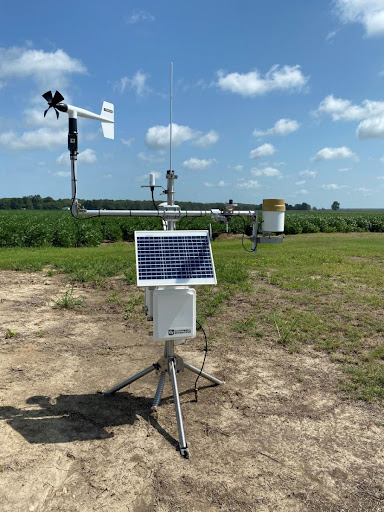
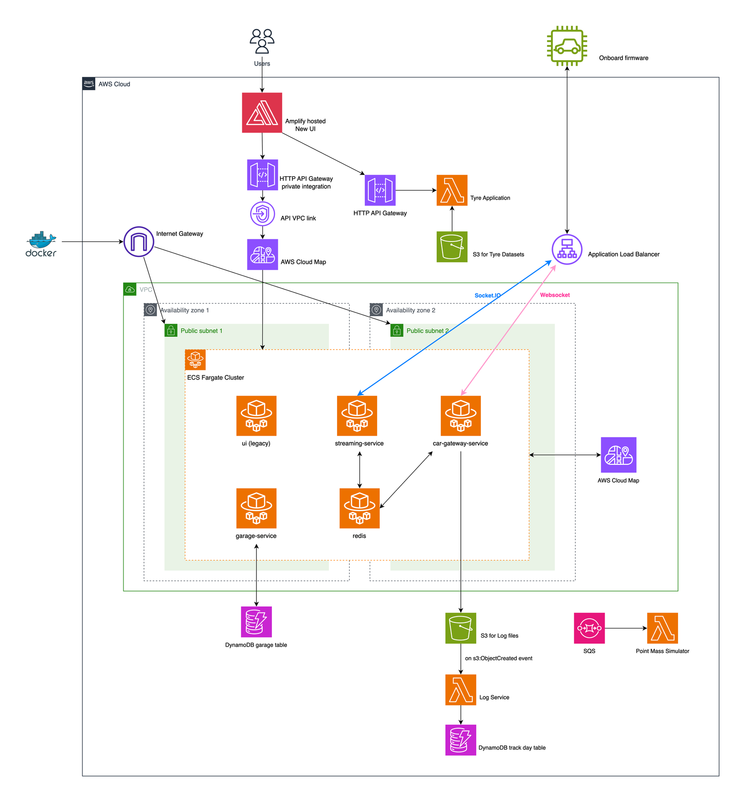
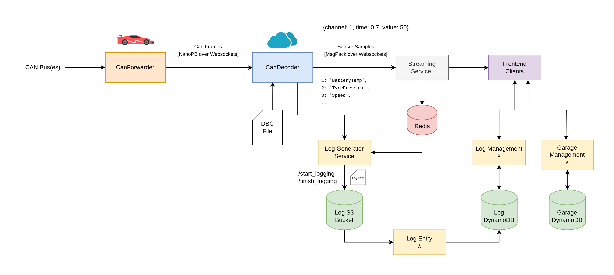

## Vehicle Analytics Cloud Technical Assessment

This assessment is part of the **Vehicle Analytics (VA) technical assessment**.  
It is a **theoretical cloud architecture task** – you will not be writing or running code here.

---

## Key Concepts

- Design a scalable cloud architecture.
- Integrate new data sources into an existing Vehicle Analytics platform.
- Justify design decisions, including **budget, security, performance, scalability, and operability**.
- Describe how you would use **Infrastructure as Code (IaC)** (e.g. Terraform, AWS CDK) conceptually.

---

## Scenario

The Vehicle Analytics team wants to implement a **local weather station collection system** so race
engineers can correlate **local weather data** with **vehicle performance and telemetry**.

The team currently uses **Amazon Web Services (AWS)** to deploy and run their systems.

The weather station will be set up on track days to monitor:

- Ambient temperature and humidity
- Track temperature
- Wind speed and direction

It is **offboard the car** and therefore requires its own solution to connect with the **AWS-based
Vehicle Analytics cloud streaming/processing services**.

Below is the current cloud architectural diagram adapted for the Vehicle Analytics system:

Your job is to extend or adjust this architecture to integrate the weather station as a first-class
data source in the VA platform.

---

## Tasks

Investigate and propose a **change or addition** that would allow weather-station data to be
integrated into the Vehicle Analytics cloud system.

You are expected to submit a **PDF document** which includes:

- An updated **architecture diagram** showing what the system would look like.
  - You may edit the existing [`cloud_diagram.drawio`](./cloud_diagram.drawio) file
    (use [draw.io](https://app.diagrams.net/)), or create a new diagram.
- A written explanation of **how you would implement it**, including:
  - Data ingestion path(s) from the weather station into the cloud.
  - Processing, storage, and access patterns for weather data.
  - How this integrates with existing telemetry/log systems.

You do **not** have to implement this system; however, you may reference **IaC examples** (Terraform,
CDK, etc.) conceptually where you see fit.

Be prepared (in an interview) to walk through and justify your implementation.

---

## Considerations

- This is a **free-form assessment**. You can design the cloud solution in any way you see fit,
  including adjusting the diagram above.
- You can design the weather station to transmit data in any protocol you see fit.
- You may:
  - Adapt current ECS/compute clusters to suit your solution, or
  - Create new services dedicated to weather ingestion and processing.
- The Vehicle Analytics team uses **Infrastructure as Code** (for example, Terraform or AWS CDK) to
  deploy systems. In your **PDF and `justification.md`**, describe how you would use IaC to deploy
  the services required for the weather station (conceptually only).
- The team uses Docker to containerise applications. Consider how containerisation might be used
  for:
  - Cloud services (e.g. ingestion, processing APIs).
  - Any on-site gateway or edge component (if you choose to introduce one).
- Consider where weather station data can be stored and how it will be queried alongside:
  - Telemetry streams.
  - Log files (currently stored in S3 buckets).

As an additional reference, you may use the following high-level software flow diagram, which shows
how data moves from the car to the cloud. You can draw inspiration from this when designing how
weather data flows through the system:

---

## Deliverables

You should provide:

1. A **PDF document** that includes:
   - An updated architecture diagram (exported from `cloud_diagram.drawio` or a new diagram).
   - A written explanation of your architecture and key decisions.
2. A filled-in **`justification.md`** in this repository.

---

## What to put in `justification.md`

Use `justification.md` to briefly document:

- High-level architecture overview.
- How the weather station integrates into the existing Vehicle Analytics platform.
- Key design decisions (e.g. services chosen, data flow, networking, security).
- Trade-offs (cost vs. performance, complexity vs. flexibility, etc.).
- How you would use **IaC** (Terraform, AWS CDK, or other) at a high level to provision this design.

---

## Helpful resources

- [AWS Well-Architected Framework](https://docs.aws.amazon.com/wellarchitected/latest/framework/wellarchitected-framework.pdf)
- [AWS Architecture Center](https://aws.amazon.com/architecture/)
- [Terraform documentation](https://developer.hashicorp.com/terraform/docs)
- [AWS CDK documentation](https://docs.aws.amazon.com/cdk/api/v2/)
- [Draw.io (diagrams.net)](https://app.diagrams.net/)

